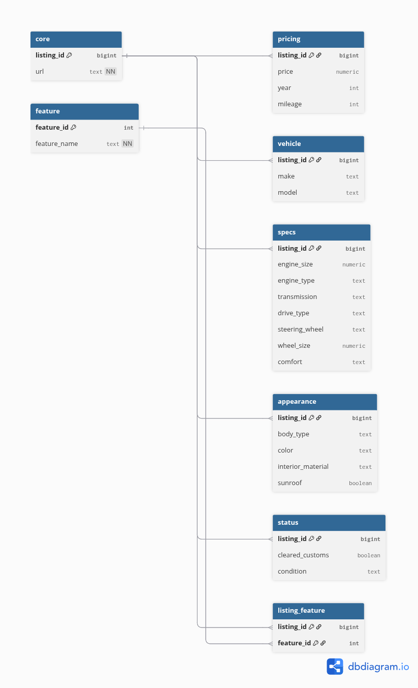

# Ավտոմեքենաների շուկայի տվյալների բազա (DBMS Final Project)

## Նախագծի նկարագրություն

Այս նախագիծը իրականացվել է որպես «Տվյալների բազաների կառավարում» (DBMS) առարկայի ավարտական աշխատանք։  
Նպատակն է իրական տվյալների հիման վրա նախագծել, ստեղծել և օգտագործել նորմալիզացված PostgreSQL տվյալների բազա՝ ընդգրկելով տվյալների հավաքում, մաքրում, բազայի կառուցում, տվյալների ներմուծում և վերլուծական SQL հարցումներ։

---

## Տվյալների աղբյուր և սկրեյփինգ

Տվյալները սքրեյփ են արվել **List.am** կայքի **«Ավտոմեքենաներ»** բաժնից։

- Սքրեյփինգի կոդը գտնվում է `list_car_scraper-main` ֆայլում
- Սքրեյփինգի գործընթացը իրականացվում է Python լեզվով
- Կոդը գրված է այնպես, որ տվյալների հավաքման ընթացքում միաժամանակ իրականացվում է՝
  - բացակայող արժեքների մշակում
  - տվյալների տիպերի վերափոխում
  - ոչ վավեր արժեքների մաքրում

Սքրեյփինգի արդյունքը մեկ ամբողջական CSV ֆայլ է՝  
**`car_data.csv`**, որը պարունակում է արդեն մաքրված և վերլուծության համար պատրաստ տվյալներ։

---

## Տվյալների մշակման և բաժանման փուլ

Սքրեյփված ամբողջական տվյալների ֆայլը հետագայում մշակվել է Python-ի միջոցով և բաժանվել է մի քանի տրամաբանական աղյուսակների՝ տվյալների բազայի նորմալիզացիայի նպատակով։

Տվյալները բաժանվել են հետևյալ CSV ֆայլերի՝

- `core.csv`
- `vehicle.csv`
- `pricing.csv`
- `specs.csv`
- `appearance.csv`
- `status.csv`
- `feature.csv`
- `listing_feature.csv`

Այս բաժանումը թույլ է տալիս ապահովել **3-րդ նորմալ ձև (3NF)** և խուսափել տվյալների կրկնությունից։

---

## Տվյալների բազայի կառուցում (Database Design)

Տվյալների բազան ստեղծվել է **PostgreSQL** միջավայրում և ունի հետևյալ հիմնական առանձնահատկությունները․

- Ստեղծվել է առանձին schema՝ `car_market` (ոչ public)
- Բոլոր աղյուսակները ունեն առաջնային բանալի (Primary Key)
- Կիրառվել են արտաքին բանալիներ (Foreign Keys)
- Կա many-to-many կապ `feature` և `core` աղյուսակների միջև՝ `listing_feature` միջանկյալ աղյուսակի միջոցով
- Տվյալները նորմալիզացված են առնվազն մինչև 3NF
- Իրականացվել է տվյալների բաժանում (partitioning) ըստ `year` դաշտի՝ վերլուծական հարցումների արդյունավետության համար
- Ստեղծվել են համապատասխան ինդեքսներ

Տվյալների բազայի կառուցվածքը ներկայացված է ER Diagram-ում։

---

## ER Diagram

ER Diagram-ը ցույց է տալիս աղյուսակների միջև կապերը, առաջնային և արտաքին բանալիները։

---

## Տվյալների ներմուծում (Data Insertion)

Տվյալների ներմուծումը իրականացվել է Python լեզվով՝ օգտագործելով `psycopg2` գրադարանը։

Ներմուծման գործընթացը ներառում է՝

- CSV ֆայլերի ընթերցում
- Տվյալների վերջնական մաքրում և վավերացում
- Batch insert մեխանիզմ տվյալների արագ ներմուծման համար
- Transaction management (COMMIT / ROLLBACK)
- Սխալների գրանցում (logging)

Տվյալների բազայի մուտքային տվյալները (host, user, password և այլն) սահմանվում են **environment variables-ի միջոցով**, ոչ թե կոդում։

---

## SQL հարցումներ և վերլուծություն

Նախագիծը ներառում է բարդ և վերլուծական SQL հարցումներ, որոնք ցույց են տալիս՝

- JOIN-ների կիրառումը
- Aggregation (COUNT, AVG, MIN, MAX)
- Window functions
- CTE-ներ և ենթահարցումներ
- CASE WHEN տրամաբանություն
- Partition-aware հարցումներ
- EXPLAIN ANALYZE՝ կատարման պլանի վերլուծության համար

Յուրաքանչյուր հարցում ունի մեկնաբանություն և բիզնես իմաստի բացատրություն։

---

## Ֆայլերի կառուցվածք

car-market-dbms-project/

│

├── data/                              # Սքրեյփված և մշակված տվյալներ (CSV)

│   ├── car_data.csv                   # Սքրեյփինգի վերջնական արդյունք

│   ├── core.csv

│   ├── vehicle.csv

│   ├── pricing.csv

│   ├── specs.csv

│   ├── appearance.csv

│   ├── status.csv

│   ├── feature.csv

│   └── listing_feature.csv

│

├── list_car_scraper-main/             # Տվյալների սքրեյփինգ (List.am)

│

├── scripts/                           # Տվյալների մշակում և ներմուծում

│   ├── split_data.py                  # car_data.csv → նորմալիզացված CSV-ներ

│   ├── data_insertion.py              # CSV → PostgreSQL

│   └── tables_creator.py

│

├── sql/                               # SQL սկրիպտներ

│   ├── schema.sql                     # Schema, tables, constraints, partitions

│   └── queries.sql                    # Վերլուծական SQL հարցումներ

│

├── docs/                              # Փաստաթղթեր

│   ├── ER_Diagram.png

│   └── Report.pdf

│

├── README.md

└── .gitignore

---

## Եզրակացություն

Այս նախագիծը ցուցադրում է տվյալների բազայի նախագծման ամբողջական գործընթաց՝
իրական տվյալների հիման վրա՝ սկսած տվյալների հավաքումից մինչև վերլուծական SQL հարցումներ։  
Նախագիծը համապատասխանում է DBMS առարկայի բոլոր պահանջներին և նախատեսված է ուսումնական նպատակների համար։

---

**Նախագծի Հեղինակ**  
Sergey  
DBMS Final Project – 2026
